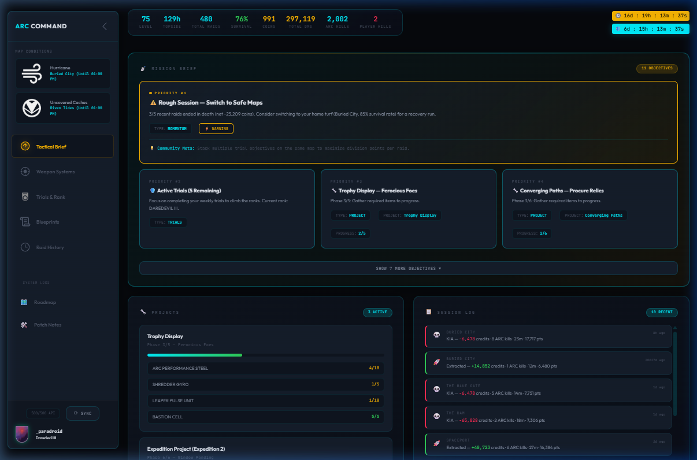
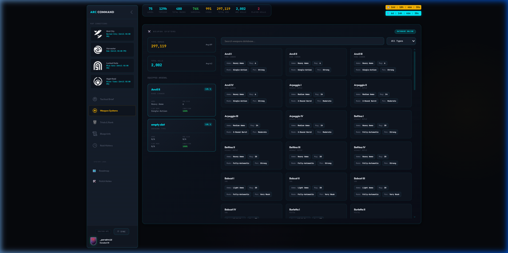
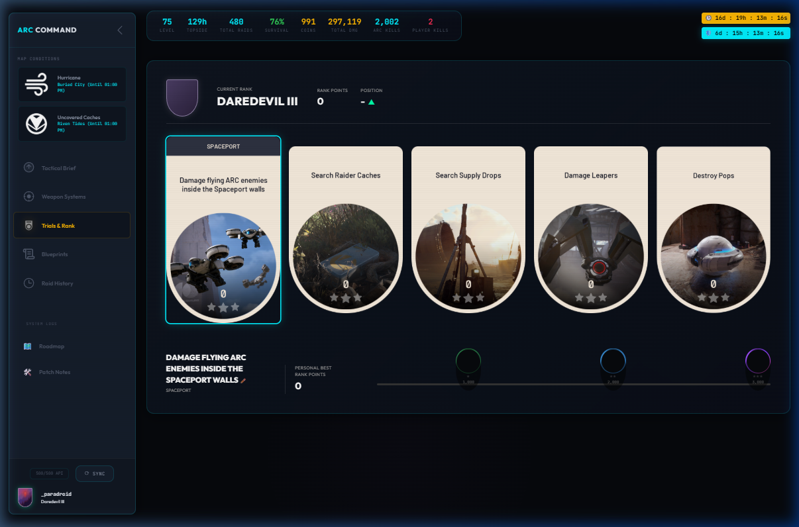
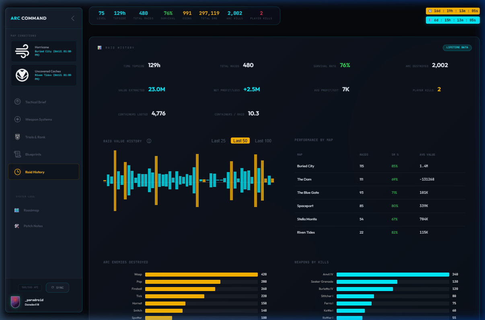

<div align="center">

# ⚡ ARC Command Center

**A personalized tactical mission planner for [ARC Raiders](https://www.arcraiders.com/)**

*Real-time profile analytics, raid history tracking, and AI-powered mission briefings — all in a sleek, dark-themed command interface.*

[](https://github.com/paradroidlabs/arc-command-center)
[](https://vitejs.dev/)
[](https://developer.mozilla.org/en-US/docs/Web/JavaScript)

</div>

---

## 📸 Screenshots

### Tactical Brief (Dashboard)
The main command view. An AI-driven **Mission Brief** prioritizes your next objectives, while live panels track your active projects, quests, session logs, map conditions, and inventory status.



### Weapon Systems
A full arsenal database with your equipped loadout, total damage and kill stats, and a searchable/filterable weapons catalog pulled directly from the game API.



### Trials & Rank
Visual trial cards with progress tracking. See your current rank, active weekly trials, and personal bests at a glance.



### Raid History & Analytics
Deep performance analytics across 480+ raids: value history charts with interactive tooltips, per-map survival rates, enemy kill breakdowns, and weapon effectiveness rankings.



---

## ✨ Features

| Category | Highlights |
|---|---|
| **Mission Brief** | AI advisor engine generates prioritized action items based on your current profile, survival rate, economy, and active objectives |
| **Live Profile Stats** | Level, time topside, total raids, survival rate, coins, ARC kills, and player kills — updated every sync |
| **Departure Timers** | Countdown timers for active map condition windows and season end |
| **Project Tracker** | Tracks crafting projects with per-material progress bars and phase indicators |
| **Quest Tracker** | Displays active quests with descriptions and completion status |
| **Blueprints Archive** | Full blueprint catalog showing acquired vs. missing schematics with category groupings |
| **Weapon Systems** | Searchable weapons database with ammo type, fire mode, penetration, and magazine stats |
| **Trials & Rank** | Visual trial cards with rank badge, progress stars, and personal best tracking |
| **Raid History** | Interactive value history chart, per-map performance table, enemy & weapon kill leaderboards |
| **Session Log** | Recent raid feed with map, credits earned/lost, kills, duration, and extraction points |
| **Map Intel** | Live map condition display with official icons and expiration timers |
| **System Logs** | In-app patch notes and development roadmap rendered from markdown files |

---

## 🏗️ Architecture

```
arc-command-center/
├── index.html              # Single-page app shell
├── index.css               # Full design system (CSS custom properties, components)
├── vite.config.js          # Vite dev server config with API proxy
├── package.json
├── changes.md              # In-app patch notes (rendered in System Logs)
├── roadmap.md              # In-app development roadmap (rendered in System Logs)
│
├── src/
│   ├── app.js              # Main entry — data loading, routing, render orchestration
│   │
│   ├── data/               # Data layer
│   │   ├── api-client.js       # ARC Tracker API client (profile, rounds, items)
│   │   ├── profile-state.js    # Profile data aggregation & normalization
│   │   ├── trials-state.js     # Trial parsing, image mapping, progress calc
│   │   ├── history-stats.js    # Raid history statistics & per-map analytics
│   │   └── drop-rates.js       # Loot table & drop rate reference data
│   │
│   ├── engine/
│   │   └── advisor.js          # AI mission advisor — generates prioritized action plans
│   │
│   └── ui/components/      # UI components (vanilla JS, template literals)
│       ├── header.js           # Stats bar & profile summary
│       ├── sidebar.js          # Navigation, map conditions, system logs
│       ├── action-panel.js     # Mission Brief objective cards
│       ├── session-log.js      # Recent raids feed
│       ├── project-tracker.js  # Crafting project progress
│       ├── quest-tracker.js    # Active quests display
│       ├── blueprint-shortcut.js # Blueprint progress card
│       ├── blueprints-panel.js # Full blueprints archive
│       ├── weapons-panel.js    # Weapons database & loadout
│       ├── trials-panel.js     # Trials & rank visualization
│       ├── raid-history-panel.js # History charts & analytics
│       ├── charts.js           # Reusable chart rendering (canvas)
│       ├── map-intel.js        # Map condition cards
│       ├── inventory-status.js # Stash & inventory overview
│       ├── departure-panel.js  # Countdown timer banners
│       └── system-logs.js      # Markdown doc viewer (roadmap/changelog)
│
├── public/images/          # Trial icons, rank badges, map condition icons
├── docs/                   # Project documentation
│   ├── screenshots/            # App screenshots for README
│   ├── WALKTHROUGH.md          # Development history & build log
│   ├── api-reference.md        # ARC Tracker API documentation
│   └── DATA_GAPS.md            # Known data gaps & limitations
└── tools/
    ├── scripts/            # One-off data extraction & download utilities
    └── translator/         # OCR translation utility (Python/Flask)
```

### Design Decisions

- **Zero frameworks** — Pure vanilla JavaScript with ES modules. No React, no Vue, no build-time templating. Components render via template literals into the DOM.
- **CSS-first design system** — All theming flows through CSS custom properties (`:root` variables). Dark mode by default. Glassmorphism panels with backdrop blur.
- **Vite for DX** — Hot module replacement during development. The Vite config proxies API requests to `arctracker.io` to avoid CORS issues.
- **Modular data layer** — API calls, data normalization, and analytics are cleanly separated from UI rendering.
- **In-app documentation** — `changes.md` and `roadmap.md` are parsed with the `marked` library and rendered directly inside the app's System Logs panel.

---

## 🚀 Getting Started

### Prerequisites

- [Node.js](https://nodejs.org/) (v18+)
- An [ARC Raiders](https://www.arcraiders.com/) account with profile data on [arctracker.io](https://arctracker.io)

### Installation

```bash
# Clone the repository
git clone https://github.com/paradroidlabs/arc-command-center.git

# Navigate into the project
cd arc-command-center

# Install dependencies
npm install

# Start the development server
npm run dev
```

The app will be available at `http://localhost:5173` (or the port Vite assigns).

### Configuration

Update the player name in `src/data/api-client.js` to point to your ARC Tracker profile. The app fetches data from the public `arctracker.io` API.

---

## 📋 Roadmap

See the full [roadmap.md](roadmap.md) for planned features and improvements. Highlights:

- **Responsive Reflow Layout** — CSS-native responsive reflow for seamless module scaling across viewports
- **In-App Tooltips** — Contextual explanations for metrics like Survival Rate, Net Profit, and Time Topside
- **Raid Data Export** — Export raw JSON data from the UI
- **Map Performance Sorting** — Clickable column headers in the performance table

---

## 📝 Changelog

See [changes.md](changes.md) for the full patch notes history, also viewable in-app under **System Logs**.

---

## 🛠️ Tech Stack

| Tool | Purpose |
|---|---|
| **Vite** | Dev server, HMR, build tooling |
| **Vanilla JS** | Component rendering, state management |
| **CSS Custom Properties** | Design tokens, theming |
| **Canvas API** | Chart rendering (Raid Value History) |
| **marked** | Markdown parsing for in-app docs |
| **ARC Tracker API** | Player profile, rounds, items data |

---

## 📄 License

This project is not affiliated with or endorsed by Embark Studios or ARC Raiders. All game assets, names, and trademarks belong to their respective owners.

---

<div align="center">

*Built by [paradroidlabs](https://github.com/paradroidlabs)*

</div>
